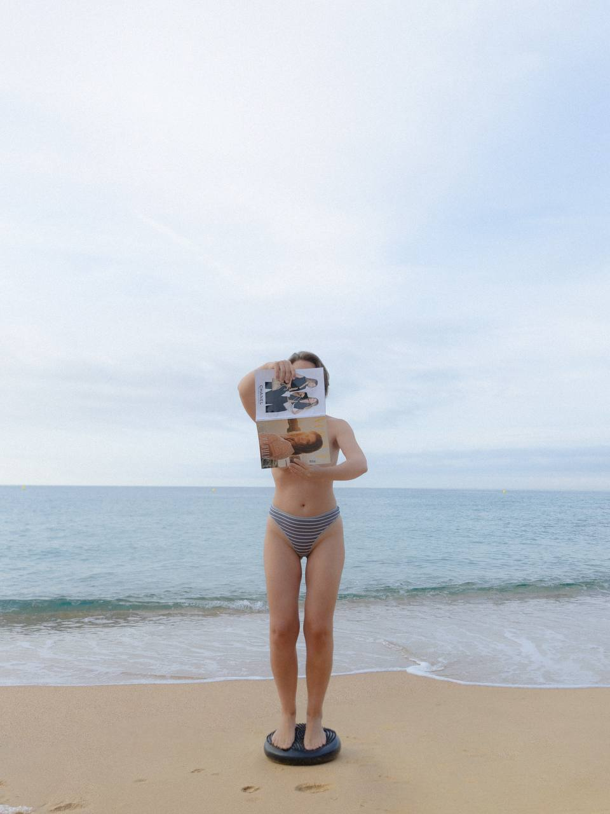

# Сайт «Дыхание для своих» — как работать

## Что в папке

```
index.html          ← весь сайт: тексты, стили, структура
img/
  do-zhivot.jpg     ← ДО (первый экран)
  posle-telo.jpg    ← ПОСЛЕ (первый экран)
  mehanika.jpg      ← блок «Механика» (на скале)
  energiya.jpg      ← баннер после результатов (горы)
  gruppa.jpg        ← блок «Мы дышим вместе»
  posle-portret.jpg ← аватарка в блоке «Три дня»
```

---

## Заливаем на GitHub Pages (один раз)

```bash
cd dyhanie-site
git init
git add .
git commit -m "landing"
git branch -M main
git remote add origin https://github.com/fedoryulia-cyber/dyhanie-site.git
git push -u origin main
```

Перед этим создай пустой репозиторий `dyhanie-site` на github.com (без README).

Затем: **репозиторий → Settings → Pages → Source: Deploy from a branch → main / (root) → Save**

Через 1–2 минуты сайт живёт на:
`https://fedoryulia-cyber.github.io/dyhanie-site/`

---

## Дальше любая правка

```bash
# поправила index.html
git add .
git commit -m "поменяла цену"
git push
```

Сайт обновится сам за минуту.

---

## Где что менять в index.html

### Заголовок первого экрана
Ищи `<h1>` — примерно строка 200.
```html
<h1>Тело держит стресс<br>и не отдаёт <em class="hl">лишнее</em></h1>
```
`<em class="hl">` — это голубой курсив. Оборачивай в него слово, которое надо выделить.

### Цена
Ищи `class="amount"`:
```html
<div class="amount">35 € <s>40 €</s></div>
<div class="sub">3 500 ₽ по раннему тарифу вместо 4 000 ₽</div>
```
`<s>` — зачёркнутая старая цена.

### Ссылки на бота и телеграм
Ищи `t.me` — заменить везде, если поменяются.
- `https://t.me/dykhanie_katya_bot` — бот
- `https://t.me/pavliushina_ekaterina` — личка Кати

### Поменять фото
Положи новый файл в `img/`, потом в коде:
```html
  →  
```
Или проще: назови новый файл так же, как старый, и просто замени файл в папке. Код трогать не надо.

### Цвета
В самом верху, в блоке `:root`:
```css
--blue:#8FB8D8;        /* светлый голубой */
--blue-deep:#5E8CB0;   /* кнопки, акценты */
--blue-pale:#EEF4F9;   /* фон секций */
--graphite:#2B3336;    /* тёмные блоки, футер */
```
Поменяешь тут — поменяется на всём сайте.

### Добавить FAQ-вопрос
Скопируй одну строчку и поменяй текст:
```html
<div class="faq-i"><div class="faq-q" onclick="t(this)">ВОПРОС<i>+</i></div><div class="faq-a">ОТВЕТ</div></div>
```

---

## Свой домен (если захочешь)

1. Купить домен (reg.ru, nic.ru — ~300–800 ₽/год)
2. В настройках домена прописать A-записи:
   ```
   185.199.108.153
   185.199.109.153
   185.199.110.153
   185.199.111.153
   ```
3. В репозитории: Settings → Pages → Custom domain → вписать домен
4. Поставить галочку Enforce HTTPS

Хостинг остаётся бесплатным. Платишь только за домен.

---

## Что стоит доделать

- [ ] Отзывы участниц (скрины комментариев из канала)
- [ ] Проверить на телефоне — оттуда придёт большая часть трафика
- [ ] Favicon (иконка во вкладке)
- [ ] Подключить метрику (Яндекс.Метрика / Google Analytics)
